# Architecture

The system has three actors (an operator, a phone caller, and the AI agent itself) and five layers. The diagram below shows them all and every flow between them.

```mermaid
flowchart TD

subgraph group_experience["Dashboard"]
  node_dashboard["Dashboard pages<br/>[page.tsx]"]
  node_call_detail["Call detail<br/>[page.tsx]"]
  node_call_trigger["Call trigger form"]
  node_config_ui["Agent config UI<br/>[page.tsx]"]
  node_api_client["Frontend API client<br/>[api.ts]"]
end

subgraph group_entry["API and telephony"]
  node_backend["FastAPI endpoints<br/>[server.py]<br/>HTTP + WebSocket"]
  node_vobiz["Vobiz telephony"]
  node_vobiz_client["Vobiz REST adapter<br/>[client.py]"]
  node_call_state["Call tracking<br/>[call_state.py]"]
end

subgraph group_conversation["Voice conversation"]
  node_pipeline["Voice pipeline<br/>[agent_pipeline.py]"]
  node_flow_nodes["Conversation stages<br/>[nodes.py]"]
  node_guardrail["Prompt guardrail<br/>[guardrail.py]"]
  node_validators["Input validators<br/>[validators.py]"]
  node_languages["Language prompts<br/>[languages.py]"]
end

subgraph group_compliance["Compliance"]
  node_compliance["Calling and PII controls<br/>[pii.py]"]
  node_audit[("Compliance audit<br/>[audit.py]")]
end

subgraph group_data["Data stores and post-call"]
  node_database[("Supabase records<br/>[supabase_client.py]")]
  node_agent_config[("Agent configuration<br/>[agent_config.py]")]
  node_recordings[("R2 recordings<br/>[r2_client.py]")]
  node_summary["Post-call summary<br/>[summarizer.py]"]
end

subgraph group_operations["Runtime support"]
  node_redis[("Session state<br/>[redis_store.py]")]
  node_metrics["Pipeline metrics<br/>[metrics.py]"]
  node_settings["Runtime settings<br/>[settings.py]"]
end

node_operator(("Operator"))
node_phone(("Phone caller"))

node_operator -->|"reviews calls"| node_dashboard
node_operator -->|"starts call"| node_call_trigger
node_operator -->|"configures agent"| node_config_ui
node_dashboard -.->|"fetches data"| node_api_client
node_call_detail -.->|"fetches detail"| node_api_client
node_call_trigger -.->|"submits request"| node_api_client
node_config_ui -.->|"updates settings"| node_api_client
node_api_client -.->|"HTTP requests"| node_backend

node_phone -->|"places and receives calls"| node_vobiz
node_vobiz -->|"posts callbacks<br/>(HTTP: /answer, /incoming, /hangup)"| node_backend
node_vobiz -.->|"WebSocket audio stream<br/>(/ws)"| node_backend
node_backend -->|"initiates calls"| node_vobiz_client
node_vobiz_client -->|"REST requests"| node_vobiz
node_backend -->|"tracks calls"| node_call_state

node_backend -->|"runs conversation"| node_pipeline
node_pipeline -->|"initializes flow"| node_flow_nodes
node_pipeline -->|"applies checks"| node_guardrail
node_pipeline -->|"uses validators"| node_validators
node_pipeline -->|"loads language config"| node_languages
node_pipeline -->|"uses session state"| node_redis
node_pipeline -->|"loads config"| node_agent_config
node_pipeline -->|"records events"| node_audit
node_pipeline -->|"collects metrics"| node_metrics

node_backend -->|"enforces controls"| node_compliance
node_backend -->|"persists call data"| node_database
node_backend -->|"reads config"| node_agent_config
node_backend -->|"writes audit events"| node_audit
node_backend -->|"generates summary"| node_summary
node_backend -->|"stores recordings"| node_recordings
node_backend -->|"loads settings"| node_settings

node_database -.->|"serves call data"| node_dashboard
node_recordings -.->|"provides playback"| node_call_detail

classDef toneNeutral fill:#f8fafc,stroke:#334155,stroke-width:1.5px,color:#0f172a
classDef toneBlue fill:#dbeafe,stroke:#2563eb,stroke-width:1.5px,color:#172554
classDef toneAmber fill:#fef3c7,stroke:#d97706,stroke-width:1.5px,color:#78350f
classDef toneMint fill:#dcfce7,stroke:#16a34a,stroke-width:1.5px,color:#14532d
classDef toneRose fill:#ffe4e6,stroke:#e11d48,stroke-width:1.5px,color:#881337
classDef toneIndigo fill:#e0e7ff,stroke:#4f46e5,stroke-width:1.5px,color:#312e81
classDef toneTeal fill:#ccfbf1,stroke:#0f766e,stroke-width:1.5px,color:#134e4a

class node_dashboard,node_call_detail,node_call_trigger,node_config_ui,node_api_client toneBlue
class node_backend,node_vobiz,node_vobiz_client,node_call_state toneAmber
class node_pipeline,node_flow_nodes,node_guardrail,node_validators,node_languages toneMint
class node_compliance,node_audit toneRose
class node_database,node_agent_config,node_recordings,node_summary toneTeal
class node_redis,node_metrics,node_settings,node_operator,node_phone toneIndigo
```



## Reading the Diagram

Every box names a file in the repository. The color groups mirror the layered architecture: frontend (blue) → API and telephony (amber) → pipeline (green) → compliance and data (rose and teal) → runtime support (indigo).

**Blue — Dashboard.** Next.js App Router pages and the shared fetch client. Every request from the operator originates here.

**Amber — API and telephony.** FastAPI endpoints that receive HTTP requests and WebSocket connections, the Vobiz REST adapter, and the in-memory call lifecycle tracker.

**Green — Voice conversation.** The Pipecat pipeline that processes real-time audio, its two guardrails (prompt injection and tool-call validators), the language configuration, and the Flows state machine.

**Rose — Compliance.** The two files that map directly to regulatory obligations: PII detection and the audit trail writer.

**Teal — Data stores and post-call.** The Supabase client, the agent config store, the R2 client, and the summariser. Each access goes through a small wrapper class so the rest of the codebase never touches a raw client.

**Indigo — Runtime support.** The two actors, plus session state, metrics, and settings.

## Key Flows

### Outbound call

```
Operator → Dashboard → "Start call"
    → POST /call → server.py
        → calling-hours check (compliance)
        → opt-out check (Supabase)
        → Vobiz REST API (telephony/client.py)
    → Vobiz dials the caller
    → Caller answers → Vobiz fetches GET /answer
    → server.py returns VobizXML with a WebSocket URL
    → Vobiz opens WebSocket to /ws
    → create_agent_pipeline() constructs the Pipecat graph
    → Flows initializes greeting → consent → qualify
    → audio streams: STT → dedup → guardrail → LLM → TTS
    → caller or agent ends the call
    → POST /hangup → persist → schedule summary
```

### Inbound call

Identical to outbound from the WebSocket onward. The only difference is the entry point: Vobiz fetches `GET /incoming` instead of `/answer`, and the language is resolved from the dialed number rather than from the request body.

### Config change

```
Operator → Dashboard → "Save changes"
    → PUT /agents/config → server.py
        → validation
        → Supabase upsert (agent_config.py)
        → cache invalidated
    → next call reads the new config at pipeline creation
```

### Playback

```
Operator → Call detail page → "Play"
    → GET /calls/{uuid}/recording-url → server.py
        → presigned URL from R2 (storage/r2_client.py)
    → browser streams the audio directly from R2
```

## Design notes

The diagram intentionally shows **two arrows from Vobiz back to the backend**: one solid (HTTP webhooks) and one dotted (WebSocket audio). These are separate channels with different characteristics. Webhooks fire at specific lifecycle moments; the WebSocket carries continuous audio in both directions during the call.

The **compliance group is separated from data stores** because the two categories serve different purposes. Compliance files exist to satisfy TRAI and DPDP obligations; data stores exist to persist application state. Grouping them together would hide that distinction.

The **summariser sits with the data stores** because it is a data-processing task, not a compliance control. It reads a transcript from Supabase, calls an LLM, and writes the result back. Post-call, not regulatory.

---

*Diagram source: [gitdiagram.com/ronincodex/voice-agent](https://gitdiagram.com/ronincodex/voice-agent). Regenerate if the file structure changes substantially.*
